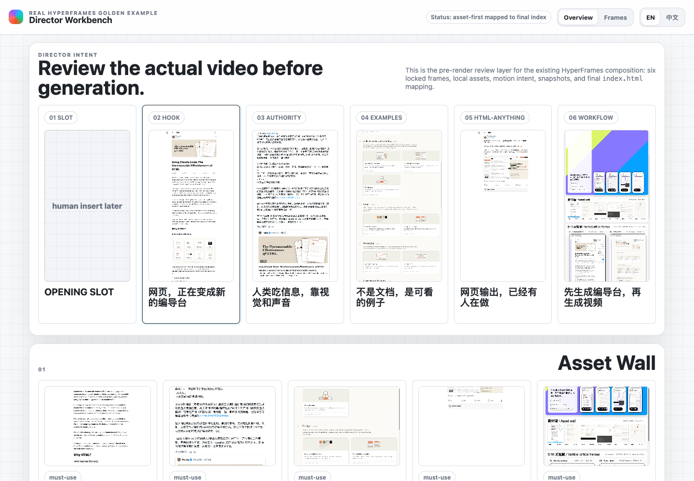
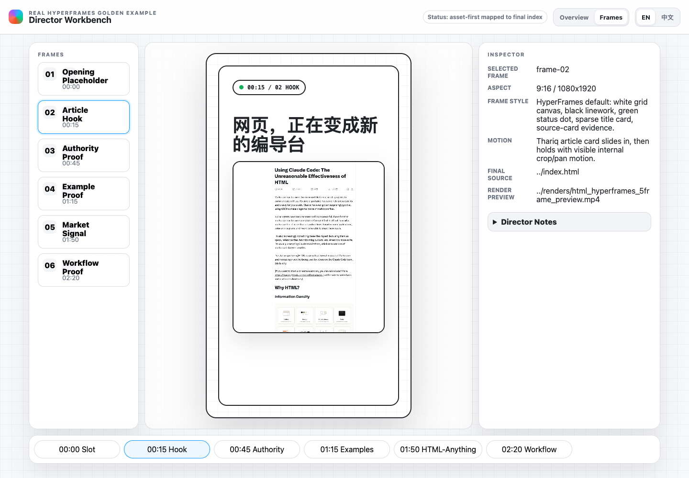

# HTML HyperFrames Harness

<p>
  <a href="./README.md">English</a> |
  <strong>中文</strong>
</p>



HTML HyperFrames Harness 是一个面向 HyperFrames workflow 的非官方、独立社区包。它在最终 HyperFrames `index.html` 生成之前，增加一层 **Director Workbench**。

它解决的问题很具体：如果没有视觉审查层，agent 可以说它理解了视频，但人很难在 render 前判断节奏、素材、关键帧排版和 motion intent 到底对不对。

这个 harness 的作用，就是先把这些决定变得可见。

## 快速链接

- [Live demo](https://xwxga.github.io/html-hyperframes-harness/)
- [Director Workbench example](https://xwxga.github.io/html-hyperframes-harness/examples/html-hyperframes-video-project/harness/direction_board.html)
- [Final HyperFrames source](https://xwxga.github.io/html-hyperframes-harness/examples/html-hyperframes-video-project/index.html)
- [Preview MP4](https://xwxga.github.io/html-hyperframes-harness/examples/html-hyperframes-video-project/renders/html_hyperframes_5frame_preview.mp4)

## 这是什么

核心 artifact 是 `direction_board.html`。它是一个静态 Director Workbench，位于最终 HyperFrames composition 之前。

它用于锁定：

- 视频节奏和章节结构；
- 真实素材及其角色；
- 每个计划帧的关键帧排版；
- 视觉系统和关键帧风格；
- 最终 HyperFrames composition 需要保留的 motion intent；
- 已审查帧到最终 `index.html` 的映射。

这个仓库不是 HyperFrames fork，也不是 OpenDesign fork。除非被上游接受，否则它不代表 HyperFrames 官方。HyperFrames 是目标 workflow；Figma-like / OpenDesign-style 只是描述 workbench UI 的语言。

## 工作流

1. 从用户 brief 和真实素材开始。
2. 填写 `templates/` 里的 harness Markdown。
3. 用 `board/direction_board.template.html` 生成 Director Workbench。
4. 在 Overview 里审查 contact sheet、asset wall、storyboard、visual system 和 motion timeline。
5. 在 Frames 里逐帧审查。
6. 把接受的修改同步回 Markdown。
7. 将 `04_render_plan.md` 标记 ready。
8. 再交给 HyperFrames 生成最终 `index.html`。



## 示例

`examples/html-hyperframes-video-project/` 是一个真实 6 帧 HyperFrames 视频项目。它包含完整 harness Markdown、Director Workbench、本地素材、snapshots、轻量 preview MP4、最终 HyperFrames `index.html`、`hyperframes.json` 和 `package.json`。

示例中的中文视频标题会保留，因为它们是 source content，不是 UI 文案。

## 它不是什么

- 不是 HyperFrames renderer。
- 不是后端协作应用。
- 不是绑定供应商的媒体 SDK wrapper。
- 不替代人的视觉审查。
- 不是最终 HyperFrames composition。

## 验证

发布前运行：

```bash
node scripts/validate-static.js
```

## License

MIT.
